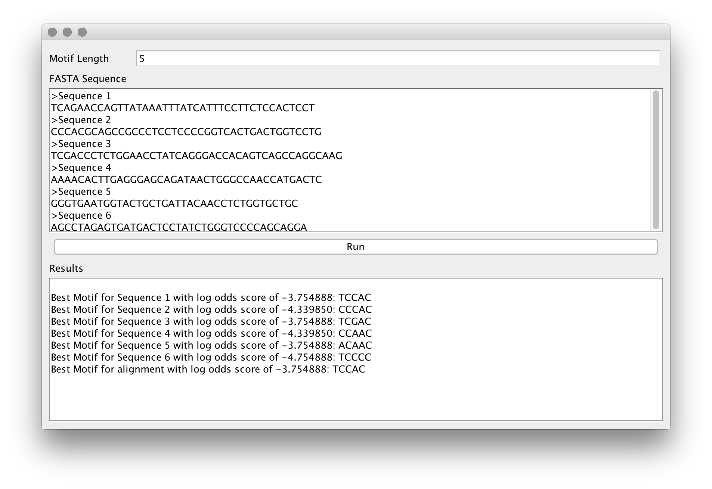

# Highest scoring Motif Detection
This repository contains the submission of Marcus Motill for programming project 2 in Bioinformatics.

## Reason for lack of EM
Marcus reached out to the instructor of the course with questions surrounding the EM algorithm but did not get a response.  Therefore, the best interpretation of the course material was implemented in this project.

## Features of Program
- User can enter as many sequences as they want in FASTA format.
  - For example [see sample input for more sequences](sampleInput.txt):
  ```
    >Sequence 1
    TCAGAACCAGTTATAAATTTATCATTTCCTTCTCCACTCCT
    >Sequence 2
    CCCACGCAGCCGCCCTCCTCCCCGGTCACTGACTGGTCCTG
    >Sequence 3
    TCGACCCTCTGGAACCTATCAGGGACCACAGTCAGCCAGGCAAG
    >Sequence 4
    AAAACACTTGAGGGAGCAGATAACTGGGCCAACCATGACTC
    >Sequence 5
    GGGTGAATGGTACTGCTGATTACAACCTCTGGTGCTGC
    >Sequence 6
    AGCCTAGAGTGATGACTCCTATCTGGGTCCCCAGCAGGA
```

- Users can specify the motif length to be found by modifying the text box in the GUI
- Program will return the best motif and log odds score for each sequence along with the best motif and log odds score for the whole alignment
- If the motif length is longer than a sequence or the entire input an error dialog will alert the user

## Example

Using sample input above and a motif length of 5 the results are:

```
Best Motif for Sequence 1 with log odds score of -3.754888: TCCAC
Best Motif for Sequence 2 with log odds score of -4.339850: CCCAC
Best Motif for Sequence 3 with log odds score of -3.754888: TCGAC
Best Motif for Sequence 4 with log odds score of -4.339850: CCAAC
Best Motif for Sequence 5 with log odds score of -3.754888: ACAAC
Best Motif for Sequence 6 with log odds score of -4.754888: TCCCC
Best Motif for alignment with log odds score of -3.754888: TCCAC
```
### GUI output


## Platform and Language
Project was built on [intelliJ community edition](https://www.jetbrains.com/idea/download/) in Java
